# 🚀 MCP App Starter Kit: Build Interactive Claude Desktop Tools
### The Ultimate Boilerplate for Model Context Protocol (MCP) Apps


**Create beautiful, interactive dashboards that render directly inside [Claude Desktop](https://claude.ai/download).**

This starter kit is the fastest way to build **MCP Apps**—the next generation of AI tools that go beyond text to offer rich, graphical user interfaces.

---

## 🌟 Why Use This Starter Kit?

Most MCP servers only return text. This kit upgrades your agent with **Interactive UIs**.

*   **⚡ Zero-Dependency Dashboard**: Includes a pro-grade, dark-themed dashboard that works in strict security environments (no external CDNs).
*   **🛡️ Bulletproof "Markdown Fallback"**: Exclusive feature! If a user's Claude version doesn't support UIs yet (e.g., Free Tier), it *automatically* renders a beautiful Markdown table & ASCII chart instead. **Your app never breaks.**
*   **📡 Double-Signal Architecture**: Broadcasts capabilities via both Standard and Experimental channels to ensure maximum compatibility with all Claude versions.
*   **🚀 Production Ready**: Fully typed TypeScript, clean architecture, and standardized tooling.

## 🎯 What You Can Build
*   Real-time Financial Dashboards (Stocks, Crypto)
*   Interactive Data Visualizations
*   Form-based Data Entry Tools
*   Status Monitors & Control Panels

## 🛠️ Quick Start

### 1. Clone & Install
```bash
git clone https://github.com/ravikant1918/mcp-app-starter.git
cd mcp-app-starter
npm install
npm run build
```

### 2. Configure Claude Desktop
Edit your config file:
*   **macOS**: `~/Library/Application Support/Claude/claude_desktop_config.json`
*   **Windows**: `%APPDATA%\Claude\claude_desktop_config.json`

Add this:
```json
{
  "mcpServers": {
    "mcp-app-starter": {
      "command": "node",
      "args": [
        "/ABSOLUTE/PATH/TO/mcp-app-starter/dist/server.js"
      ]
    }
  }
}
```
*(⚠️ Replace `/ABSOLUTE/PATH/TO/...` with your actual path!)*

### 3. See the Magic ✨
1.  **Restart Claude Desktop**.
2.  Ask: **"Get market data for RELIANCE"**
3.  Enjoy the Interactive Dashboard! (or the rich Markdown fallback if on Free Tier).

---

## 🧠 How It Works (The Architecture)

This kit implements the **[Model Context Protocol (MCP)](https://modelcontextprotocol.io/)** with the **MCP Apps Extension**.

```mermaid
sequenceDiagram
    participant User
    participant Claude as Claude Desktop
    participant Server as MCP App Server

    User->>Claude: "Show me market data"
    Claude->>Server: tools/call (get_market_data)
    Server-->>Claude: Result + UI Trigger (_meta.ui.resourceUri)
    
    alt UI Supported
        Claude->>Server: resources/read (ui://...)
        Server-->>Claude: HTML Dashboard
        Claude->>User: Renders Interactive UI 🖥️
    else UI Not Supported
        Claude->>User: Renders Markdown Fallback 📝
    end
```



## 📂 Project Structure

*   `src/server.ts`: The brain. Handles MCP protocol, tool execution, and the clever fallback logic.
*   `src/dashboard.html`: The beauty. A standalone HTML5 file with inline CSS/SVG. No React, no heavy builds—just pure performance.

## 📜 License
MIT License. Feel free to use this for personal or commercial projects!

---
*Built with ❤️ for the MCP Community. Star this repo if it helped you! ⭐*
