# What Are MCP Apps? A Developer Guide to Interactive AI Tools for Claude

*By Ravi kant Yadav*


You ask an AI to show your cloud costs.
It replies with 12 lines of text.
You ask again to sort it by region.
You ask again to filter it by instance type.
Again.
Again.

For developers and power users, this "Prompt-Response Loop" is exhausting. Text is great for summaries, but it is terrible for exploration.

Enter **MCP Apps**—the new standard for building **interactive AI tools** that render directly inside **Claude Desktop**. This is the shift from "Chatbots that talk" to "Agents that do."

In this article, we’ll break down what MCP Apps are, how they work, and how developers can use them to build interactive AI tools inside Claude Desktop.

## TL;DR
- **MCP Apps** extend the [Model Context Protocol (MCP)](https://modelcontextprotocol.io/) with interactive UIs.
- They render dashboards, charts, and forms directly inside **Claude Desktop**.
- They solve the usability trap of **text-only AI tools**.
- A **fallback strategy** is critical for compatibility across different client versions.

---

## What is the Model Context Protocol (MCP)?

The **[Model Context Protocol (MCP)](https://modelcontextprotocol.io/)** is an open standard that defines how AI models securely interact with external tools, resources, and context. Before MCP, every integration (Google Drive, Slack, GitHub) required custom glue code. With MCP, you build a "Server" once, and any "Host" (like Claude Desktop, Cursor, or Zed) can connect to it.

But until recently, MCP was limited to text.

## The Problem: Text-Only MCP Servers

Standard MCP servers are powerful but invisible. They return JSON, which the LLM summarizes into text.

*   **The Limitation**: If you want to visualize data, you have to describe the visualization to the AI and hope it generates an ASCII table or a static image.
*   **The Solution**: **LLM UI rendering**. Instead of describing the UI, the AI *serves* the UI.

## What Are MCP Apps?

**[MCP Apps](https://modelcontextprotocol.io/docs/extensions/apps)** are a specialized extension of the protocol. They combine standard MCP Tools with **Interactive UIs**.

When an AI uses an MCP App tool, it doesn't just get data back—it receives a pointer to a user interface. The Host (Claude Desktop) then renders this UI in a secure, sandboxed iframe.

### MCP Apps vs Plugins vs Custom UIs

| Feature | Standard MCP Tool | ChatGPT Plugin | **MCP App** |
| :--- | :--- | :--- | :--- |
| **Output** | Text / JSON | Text / JSON | **Interactive HTML/JS** |
| **Interaction** | Prompting ("Next page") | Prompting | **Clicking, Scrolling, Typing** |
| **Hosting** | Local or Remote | Remote Only | **Local or Remote** |
| **Experience** | Chat-based | Chat-based | **App-like Dashboard** |
| **Security Model** | Depends on Host | Cloud-controlled | **Host-sandboxed** |

## Who Should Care About MCP Apps?

*   **Platform Engineering Teams**: Build an interactive "Internal Developer Platform" inside Claude where devs can restart servers or view logs without leaving the chat.
*   **Backend Engineers**: Expose your APIs as tools that come with their own debug dashboards.
*   **AI Infra Teams**: ongoing monitoring of model performance with live charts.
*   **Product Engineers**: Ship internal tools faster without building full frontends.

## How MCP Apps Work (The Architecture)

The architecture relies on a specialized "Triple Handshake" between the User, Host, and Server.

1.  **Discovery**: The Server helps Claude discover the tool (e.g., `get_market_data`).
2.  **Trigger**: The User asks for data. Claude calls the tool.
3.  **The Signal**: The Server returns the data *plus* a metadata flag: `_meta.ui.resourceUri`.
4.  **Rendering**: Claude sees the flag, fetches the UI Resource, and renders it.

```mermaid
sequenceDiagram
    participant User
    participant Host as Claude Desktop
    participant Server as MCP App Server

    User->>Host: "Show me the dashboard"
    Host->>Server: tools/call (get_dashboard)
    
    Note over Server: Server generates data<br/>AND a link to the UI
    
    Server-->>Host: Result + _meta.ui.resourceUri
    
    Host->>Server: resources/read (ui://dashboard)
    Server-->>Host: HTML Dashboard
    
    Note over Host: Host renders the HTML<br/>in a secure sandboxed iframe
    
    Host->>User: Displays Interactive Dashboard 🖥️
```



## Critical: The "Markdown Fallback" Strategy

As of today, **Claude Desktop extensions** are evolving rapidly. Not every user is on the latest version, and features like MCP Apps might be gated (e.g., Pro vs. Free Tier).

If you build a tool that *only* provides a UI, you risk breaking the experience for 50% of your users.

### The Solution: Dual-Mode Output

When building MCP Apps, always implement a **Markdown Fallback**.

```typescript
// server.ts (TypeScript)
return {
  content: [{ 
    type: "text", 
    // Fallback for text-only clients
    text: "# 📈 Stock Price: $150\n(Markdown table here...)" 
  }],
  _meta: {
    // Trigger for UI-enabled clients
    ui: { resourceUri: "ui://my-app/dashboard" } 
  }
};
```

This ensures that:
1.  **Power Users** get the rich, interactive dashboard.
2.  **Standard Users** get a clean, readable Markdown report.
3.  **No one** gets an error.

## A Real-World Example: The Starter Kit

To demonstrate these patterns, I’ve open-sourced a production-ready template:

**[MCP App Starter Kit](https://github.com/ravikant1918/mcp-app-starter)**

It demonstrates:
*    **Zero-Dependency UI**: Runs without external CDNs (CORS/CSP safe).
*    **Markdown Fallback**: The strategy described above.
*    **Double-Signal Tech**: Broadcasts capabilities to both "Experimental" and "Standard" protocol channels for maximum compatibility.

## The Future: Agent-App Convergence

We are moving away from "Chatting with AI" towards "Collaborating with AI."

**MCP Apps** are the bridge. They allow AI agents to summon ephemeral, purpose-built software to solve specific problems. Today, it's a stock dashboard. Tomorrow, it's a generated React component that you interact with, modify, and deploy—all without leaving the chat context.

If you are a developer, the best time to start building **interactive MCP Apps inside chat** is now.

---
*Ready to build? Fork the [MCP App Starter Kit](https://github.com/ravikant1918/mcp-app-starter) and deploy your first interactive agent today.*
